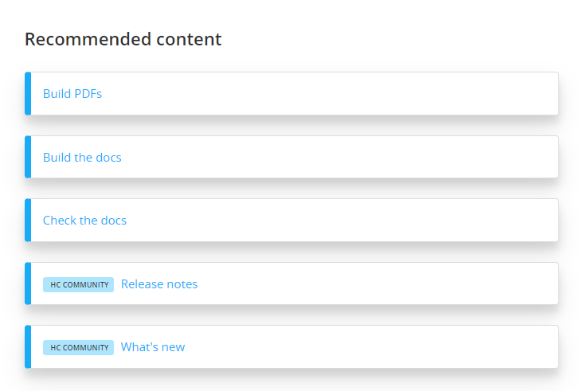

# Add a "Recommended" section beneath an article that links to related articles or other links

This feature lists related articles and other links specified in a JSON file. For articles, it cross references `index.json` in the DocFx `_site` output to get the name of a page so the name doesn't have to be hard coded.



## (If applicable) Add your customer community's base URL

Change the `hccBaseUrl` variable in `styles/main.js` to your customer community's base URL.

## Add the recommended section in the master page template

Add `<div id="recommended-articles"></div>` in `template/layout/_master.tmpl` where you want the section to show on every page. For example:

```html
<article class="content wrap" id="_content" data-uid="{{uid}}">
    {{!body}}
</article> 
<div id="recommended-articles"></div>
```

Assign recommendations in `sourcedContent/recommended.json`.
